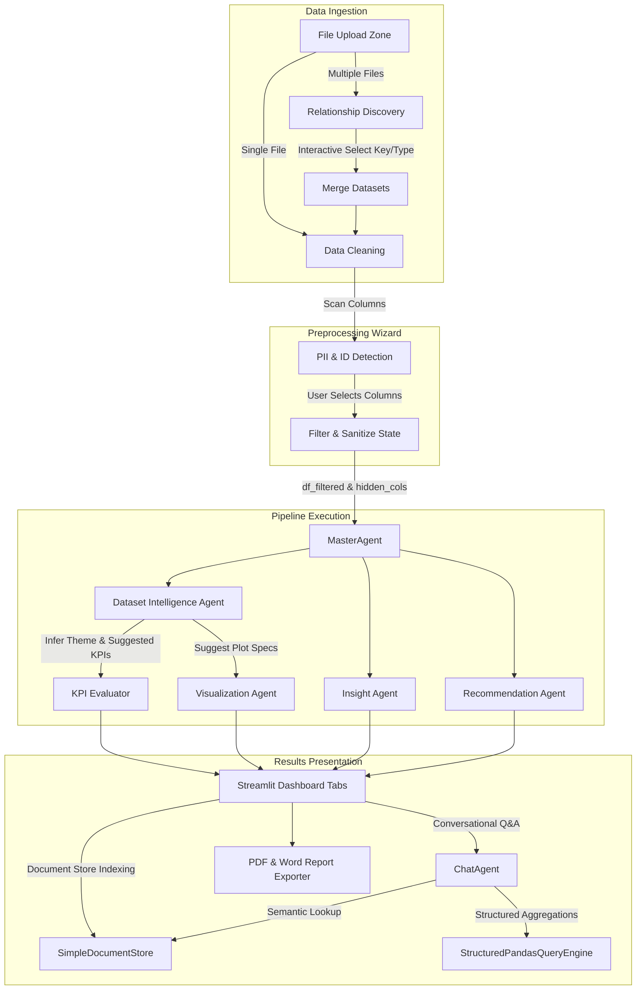

# Comprehensive Project Documentation: AI Business Analyst Platform

This document provides an exhaustive overview of the AI Business Analyst platform. It explains the system's capabilities, multi-agent architecture, code layout, data flows, and configuration.

---

## 1. System Overview

The AI Business Analyst is a dynamic, multi-agent analytics platform that automatically ingests, cleans, merges, profiles, and analyzes any tabular dataset. Instead of relying on hardcoded templates or predefined schemas, the platform uses a **Dataset Intelligence Agent** powered by Groq LLMs (like Llama-3.3-70b) to infer the dataset's domain, calculate custom business KPIs dynamically, generate custom charts, write strategic reports, and support conversational Q&A.

---

## 2. Key Capabilities

### 📂 1. Multi-Dataset Merging & Relationship Discovery
- **Automatic Joins**: Ingests multiple files (CSV, XLSX, Parquet). Programmatically scans columns for exact or primary-foreign key relationships (e.g. matching `customer_id` columns, or table IDs mapping to prefixes like `customers.id` -> `orders.customer_id`).
- **Join Coverage Stats**: Calculates overlap metrics (the match percentage of unique keys across tables) and row preview estimates before a merge is finalized.
- **Many-to-Many Warnings**: Flags duplicate keys on both sides of a suggested join to warn users of row duplication risks.
- **Visual Mermaid Planner**: Automatically renders an interactive Mermaid relationship diagram showing how tables link.

### 🧙‍♂️ 2. Preprocessing & Column Selection Wizard
- **PII & ID Scanning**: Uses heuristic algorithms to flag sensitive columns (e.g., name, phone, email, SSN, address) and entity keys.
- **Filtering Actions**:
  - **Keep**: Retains the column fully.
  - **Hide**: Hides the column from visual dashboards, charts, and downloadable reports, but keeps it in the background so the AI Chat Consultant can still query and analyze it.
  - **Exclude**: Completely drops the column from the data frame.

### 📊 3. Dynamic Theme & KPI Engine
- **Universal Profiling**: Analyzes statistical ranges, distributions, unique counts, null percentages, and sample records.
- **Theme Inference**: Automatically infers themes (e.g. "EV Vehicles Adoption", "Healthcare Registrations") if a dataset does not fall into standard domains (Sales, Marketing, HR, Finance).
- **Safe Pandas Evaluation**: The LLM designs a valid Python expression (e.g., `df['electric_range'].mean()`). The system evaluates the expression within a sandboxed environment (`eval()`), with built-in parameter-based mathematical fallbacks if execution encounters an error.

### 💬 4. Advanced Hybrid RAG Chat Consultant
- **Dual Retrieval Paths**:
  - **Structured Queries**: Translates questions into JSON query plans (filters, groupings, sorting, aggregation functions) and runs them using standard Pandas operations.
  - **Unstructured Search**: Indexes executive summaries, narrative insights, and recommendation lists into an in-memory document vector store.
- **Hidden Column Querying**: Allows the chat agent to query and report on hidden columns. When answering, the agent explains that the column was hidden from the front-end dashboard, but queries it anyway to fulfill the user's prompt.

### 📥 5. Enterprise Report Exporting
- Generates polished, corporate-styled reports in **PDF** (via ReportLab flowables) and **Word (.docx)** formats, embedding calculated KPIs, summaries, and action items.

---

## 3. System Architecture & Data Flow



---

## 4. Codebase & Directory Structure

```
business_analyst_ai/
│
├── app.py                      # UI Orchestrator, Wizards, State Managers, and Tabs layout
│
├── .env                        # Configuration for xAI API keys
├── requirements.txt            # System dependencies
├── render.yaml                 # Deployment config
├── generate_sample_data.py     # Script to generate Sales, Marketing, and HR datasets
├── test_pipeline.py            # Basic testing script for standard Sales flow
│
├── agents/                     # LLM-backed Multi-Agent Layer
│   ├── base_agent.py           # Base agent class encapsulating Groq model setup & rate limiters
│   ├── master_agent.py         # Coordinates sub-agents, merges KPIs, configurations
│   ├── dataset_intelligence_agent.py  # Profiles schema, detects PII/IDs, plans & evaluates custom KPIs
│   ├── chat_agent.py           # Handles conversational interaction via system context injection
│   ├── insight_agent.py        # Generates executive summaries, key trends, risks, opportunities
│   ├── recommendation_agent.py # Generates prioritized strategic action plans
│   └── visualization_agent.py  # Builds Plotly dashboard charts dynamically from JSON blueprints
│
├── analytics/                  # Data computation & matching algorithms
│   ├── relationship_discovery.py # Calculates column intersections, join stats, runs merges
│   └── charts.py               # Plotly helper layouts
│
├── rag/                        # Retrieval Augmented Generation utilities
│   ├── retrieval.py            # StructuredPandasQueryEngine and document index compiler
│   └── vector_store.py         # Simple cosine-similarity based vector indexing
│
├── reports/                    # Corporate Report Generation
│   ├── pdf_generator.py        # ReportLab PDF compile pipeline
│   └── docx_generator.py       # docx Word compile pipeline
│
├── utils/                      # Helper & configurations
│   ├── config.py               # Environment configuration checks
│   ├── data_cleaner.py         # Imputations, outlier clips, and duplicate drops
│   └── helpers.py              # CSS styles and UI widgets
│
└── scratch/                    # Test files & developer playground
    └── test_universal_pipeline.py # Comprehensive pipeline test suite
```

---

## 5. Component Deep Dive

### 5.1 `app.py`
The orchestrator of the user experience. It leverages Streamlit's `st.session_state` to coordinate multi-dataset merging, PII exclusions, pipeline runs, and active tabs. It encapsulates:
- **Data Upload Mode**: Direct toggles between "Single" and "Multiple" datasets.
- **Relational Plan**: Calls `discover_relationships()` to find matches, allows manual adjustments, and displays row count previews and Mermaid charts.
- **Wizard**: Sets persistent key bindings (`key="excluded_columns"`, `key="hidden_columns"`) to bypass Streamlit's widget rerun state reset bugs, sanitizing keys prior to rendering.

### 5.2 `agents/dataset_intelligence_agent.py`
The core engine for universal datasets. It does not look for preset fields; instead, it compiles numeric ranges, null statistics, category listings, and 3 sample rows. It calls the LLM with strict JSON formatting guidelines:
1. **Domain**: Inferred dataset theme.
2. **KPIs**: Generates safe Python pandas statements (e.g. `df['spend'].sum()`). 
3. **Charts**: Generates JSON configurations of required charts (e.g. `{ "type": "bar", "x_col": "manufacturer", "y_col": null }`).
4. **Execution**: Safely evaluates them using `eval()`. If evaluation fails, it attempts a statistical fallback (using `func` and `column` descriptors).

### 5.3 `analytics/relationship_discovery.py`
Inspects column sets in two uploaded dataframes to evaluate if they represent keys.
- **Rule-based Detection**: Looks for columns ending or starting with `id`, `key`, `code`, `number` and matching name combinations, or combinations matching `tableName.id` -> `otherTable.tableName_id`.
- **Intersections**: Converts key columns to lowercase stripped string sets and calculates overlap metrics:
  $$\text{Coverage} = \frac{|A \cap B|}{|A|}$$
- **Duplicate Flags**: Warns of many-to-many relationships if duplicate values are found on both key columns.

### 5.4 `rag/retrieval.py`
Encapsulates `StructuredPandasQueryEngine`. It converts questions into structured JSON plans:
- **`query_type`**: `aggregation` (for breakdowns and group-bys), `general_stats` (for global summaries), or `filter_only` (for listing rows).
- **`groupby_column`** / **`agg_column`** / **`agg_func`**: Defines the target calculations.
- **`filter_column`** / **`filter_op`** / **`filter_value`**: Isolates subset criteria.
- **Heuristic Overrides**: Overrides conversational "mean" interpretations when a user asks generic questions (e.g., "what means the most profits" -> changed from mathematical `mean` to `sum`).

---

## 6. Pipeline Ingestion & Run Lifecycle

```
[User Uploads CSVs]
         │
         ▼
[Relationship Discovery] ──► Calculates join keys & matching overlap metrics
         │
         ▼
[Preprocessing Wizard]   ──► User defines columns to Keep, Hide, or Exclude (PII/IDs auto-flagged)
         │
         ▼
[df.drop(excluded_cols)] ──► Drops excluded columns completely
         │
         ▼
[MasterAgent.run()]      ──► Runs cleaning routines (null imputation, duplicate drops)
         │
         ▼
[IntelligenceAgent.run()] ─► Infers theme, suggests custom KPIs & Plotly charts via LLM
         │
         ▼
[KPI Evaluation]         ──► Evaluates expressions safely using Python's eval()
         │
         ▼
[Narratives & Insights]  ──► Generates strategic observations, risks, and recommendations
         │
         ▼
[Index Vector Store]      ──► Populates DocumentStore with narrative outputs
         │
         ▼
[Consultant Chat / Exports] ─► Q&A is active; PDF/Word reports become ready for download
```

---

## 7. Developer Validation & Test Execution

A verification test suite is located in [test_universal_pipeline.py](file:///c:/Users/saisu/.gemini/antigravity-ide/scratch/business_analyst_ai/scratch/test_universal_pipeline.py) which can be executed in your environment to verify the core logic:

```bash
python -m scratch.test_universal_pipeline
```

This validates:
1. PII/ID heuristics correctly isolating fields (such as `vin_number`, `owner_name`, `owner_phone`).
2. Theme profiling suggesting custom domain KPIs (e.g., `Average Range` for EV vehicles).
3. Relationship mapping finding relationships between `customers.csv` and `orders.csv`, and merging them correctly.
